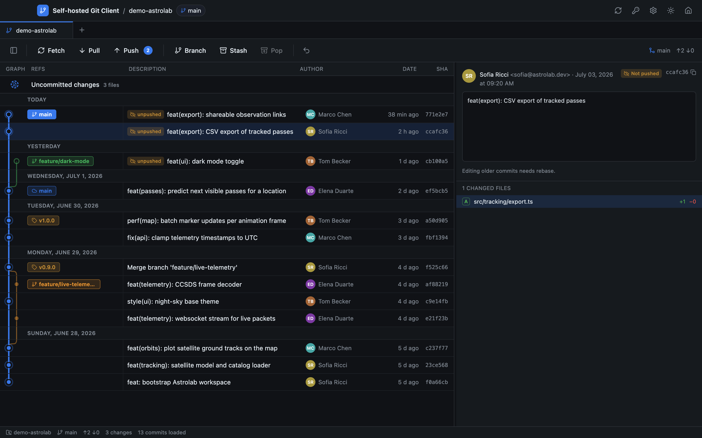

<div align="center">

# Self-hosted Git Client

### Free, open and entirely yours.

A fast, full-featured desktop Git client that runs **100% on your machine** —
no account, no telemetry, no cloud, no lock-in.

[](../../releases/latest)
[](../../releases)
[](../../actions)
[](LICENSE)


**[Download](#download)** · **[Features](#features)** · **[Keyboard shortcuts](#keyboard-shortcuts)** · **[Development](#development)**

<!-- Drop a screenshot at docs/screenshot.png and uncomment:

-->

</div>

---

## Why this client?

- 🔒 **Local-first and private.** Your repositories never leave your machine.
  The app talks to your remotes with *your* git and *your* SSH keys — there is
  no account to create and nothing is phoned home. Even author avatars are
  resolved without an API call or a third-party service.
- 🧰 **Everything included.** From everyday staging and pushing to interactive
  rebase and a visual merge-conflict editor — the whole workflow lives in one
  window.
- 🆓 **Free forever.** MIT-licensed, no paid tiers, no feature gates.
- 🎨 **Make it yours.** The entire identity (name, colors, graph palette) lives
  in [one file](src/renderer/src/branding.ts) — rebrand it in seconds.

## Download

Grab the installer for your OS from the [**Releases**](../../releases/latest) page:

| OS | File | Notes |
| --- | --- | --- |
| **macOS** | `.dmg` | Pick **arm64** (Apple Silicon) or **x64** (Intel). Drag into Applications. |
| **Windows** | `.exe` | Run the installer. |
| **Linux** | `.AppImage` / `.deb` | `chmod +x *.AppImage` and run, or install the `.deb`. |

The app **checks for new releases by itself** and offers the download when one
is available.

<details>
<summary><b>First launch on macOS / Windows (unsigned builds)</b></summary>

Builds are not code-signed, so the first launch shows a security warning —
allow it once:

- **macOS**: right-click the app → **Open** → **Open** (or System Settings →
  Privacy & Security → **Open Anyway**). If macOS reports the app as
  *damaged*, clear the quarantine flag once:

  ```bash
  xattr -cr "/Applications/Self-hosted Git Client.app"
  ```

- **Windows**: on the SmartScreen dialog click **More info** → **Run anyway**.

Prefer to build it yourself? See [Development](#development).

</details>

## Features

### 🌳 History at a glance
A colored commit **graph** with lanes for every branch, merge edges, and
commits **grouped by day**. The current branch is highlighted, unpushed commits
are marked, labels are consolidated (local/remote icons instead of duplicate
refs) and clickable — double-click a branch label to check it out. Authors show
their **GitHub avatar**, derived locally from the commit email.

### ✅ Commit with confidence
Dedicated **staged / unstaged** panels with per-file stage, unstage and
discard. Commit with **amend**, and edit the last commit's message **inline**
in the detail panel — no dialogs, just an *Update description* button.

### 🔀 Merge conflicts, solved visually
When a merge, rebase, cherry-pick or revert stops on conflicts, the files light
up in the sidebar. One click opens a **three-pane merge editor** — *ours* and
*theirs* on top, the live **result** below — where you pick whole sides or
**individual lines, in the order you click them**, with line numbers, minimaps
and synchronized scrolling. Conflicted files can't be staged until resolved;
**Continue / Abort** drive the operation from a slim banner.

### 🕰️ Rewrite history safely
**Interactive rebase** from the branch label or any commit: reorder, **squash,
fixup, drop** from a visual planner. **Undo** reverses the last branch action
(commit, reset, merge…) via the reflog — a soft reset, so nothing is ever
lost. Reset (soft/mixed/hard), revert, cherry-pick and detached-HEAD checkout
included. When a push is rejected after rewriting history, the app offers a
safe **force-push with lease**.

### 🔄 Always in sync
Push / Pull / Fetch with **ahead/behind** counters. The app **auto-fetches**
in the background — on a timer, the moment the window comes back into view,
and when you switch repos — without ever blocking the UI (a thin progress bar
shows it working) and tells you when **new commits** land on your upstream.
Checking out a branch that is behind fast-forwards it automatically.

### 🔍 Find anything
`Cmd/Ctrl+F` searches **everything** — branch and tag names, commit messages,
authors, hashes, changed file names — dimming everything that doesn't match.
With the diff editor open, the same shortcut searches **inside the code**.

### 📄 A real diff editor
Full-page diffs with the **whole file** as context, **inline or side-by-side**
(with synchronized scrolling), line numbers and a clickable **minimap**.

### 🌿 Branches, tags, stashes, remotes
Create, checkout, merge, delete (local **and** remote) and **rename** branches.
One-click **WIP stash** and pop, with editable stash messages. Tags with
create/delete, multiple remotes, and **Open in browser** to jump to any commit
or branch on your git host.

### ⚙️ Quality of life
Multiple repos as **tabs** with session restore · full **keyboard navigation**
(arrow keys across commits and files) · **SSH key manager** (generate ed25519 /
RSA, copy public key) · **light/dark theme** · settings for sync cadence and
git identity · built-in **update notifications**.

## Keyboard shortcuts

| Shortcut | Action |
| --- | --- |
| `Cmd/Ctrl+F` | Search everywhere — or in the open file when the editor is shown |
| `↑` / `↓` | Move through commits or files |
| `←` / `→` | Switch focus between the commit list and the file list |
| `Esc` | Close search → editor → dialogs (in that order) |
| `Cmd/Ctrl+Enter` | Commit / save the message being edited |
| Double-click a branch label | Checkout |
| Right-click | Context menus everywhere (commits, branches, tags, stashes) |

## Requirements

- `git` available in the `PATH`.
- `ssh-keygen` (bundled with macOS/Linux and Git for Windows) for the SSH key
  manager.
- Node.js 18+ — **only** if you build from source.

## Development

```bash
npm install
npm run dev          # start Electron + Vite in watch mode
```

```bash
npm run build        # typecheck + build main, preload and renderer
npm run dist:mac     # package for macOS (dmg/zip, arm64 + x64)
npm run dist:win     # Windows (nsis)
npm run dist:linux   # Linux (AppImage/deb)
```

### Architecture

```
src/
├── shared/         # types and IPC channel names (shared main <-> renderer)
├── main/           # Electron main process
│   ├── ipc.ts      # IPC handlers (typed { ok, data | error } envelope)
│   └── services/   # gitService (simple-git), sshService, diffParser, store
├── preload/        # secure bridge: exposes a typed window.api
└── renderer/src/   # React UI
    ├── branding.ts # ⭐ the app's identity, in one place
    ├── store/      # global state (zustand)
    ├── lib/        # graph layout, conflict parsing, formatting, avatars
    └── components/ # CommitGraph, DiffEditor, MergeResolver, RebaseModal, …
```

The backend drives the system `git` through `simple-git` — no native modules
to compile. UI and main process communicate over typed IPC only.

### Rebranding

1. **Name, tagline, colors, graph palette** →
   [`src/renderer/src/branding.ts`](src/renderer/src/branding.ts)
2. **Executable name / appId** → `package.json` (`name`) and
   [`electron-builder.yml`](electron-builder.yml) (`productName`, `appId`).

Nothing else needs to change.

## Disclaimer

This is an **independent, non-commercial project**. It is **not affiliated
with, endorsed by, or sponsored by** any company, product or service. It does
not aim to compete with any commercial offering, and it **uses no third-party
trademarks**: any names that appear in this repository (such as GitHub) belong
to their respective owners and are mentioned solely to describe
interoperability.

## Contributing

This project is **free** and maintained in spare time — updates land **when
they can, as they can**. That's exactly why your help matters:

- 🐛 Found a bug? **[Open an issue](../../issues)** — even a short report helps.
- 💡 Want something the app doesn't do yet? **Propose it** in an issue.
- 🔧 Feel like coding? **Pull requests are very welcome**, for fixes big and
  small.

We're genuinely happy every time someone opens an issue or a PR. 💙

## License

[MIT](LICENSE) — free for everyone, forever.
